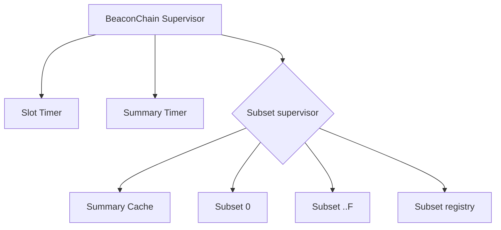

BeaconChain helps the Archethic sharding network to be supervised and provided global view of the system.

To be able to manage it, few modules and functions are needed to make this possible.

## Subsets

The BeaconChain is divided into a set of subsets (shards of the BeaconChain) based on hexadecimal splits.
Currently the BeaconChain supports 256 subsets, from 0 to F (hex)

Each subset is maintained by its own [process](https://github.com/archethic-foundation/archethic-node/blob/master/lib/archethic/beacon_chain/subset.ex)

This process is responsible of:
- Add transaction replication confirmation to the current slot
- Check [P2P availability](/build/core/beacon-chain/p2p-sampling) of the nodes where their public key starts by the subset hexadecimal identifier 
- Create beacon transaction and notify BeaconChain summary nodes (for the current epoch)
- Create beacon summary transaction (if it's one of the summary node)
- Notify explorer about the new transaction validated (See [Sharded Explorer](http://localhost:9001/archethic-docs/learn/sharding/beacon-chain/explorer))

## Timers and schedulers

Because each BeaconChain subsets change over time, we need a may to determine what are the current nodes for those subsets and so on. So we have two kind of timers and schedulers:
- Slot timer: Manage the interval for the beacon slot creations
- Summary timer: Manage the interval for the beacon summary creations

Each of those timer provides helpers to be able to generate previous or next dates

## Transaction loading

Before a transaction's confirmation is loaded into the BeaconChain, a phase of validation is performed to ensure the correctness of the replication:
- it asserts the transaction's address is the right one
- it asserts the transaction attestation (node election, signatures, etc.)

For more details, [SlotValidation](https://github.com/archethic-foundation/archethic-node/blob/master/lib/archethic/beacon_chain/slot/validation.ex)

Then the slot is deserialized to be loaded into a cache, for a faster summary aggregation and computation

## Supervisor
To manage all those processes and isolation a proper supervision tree is defined

