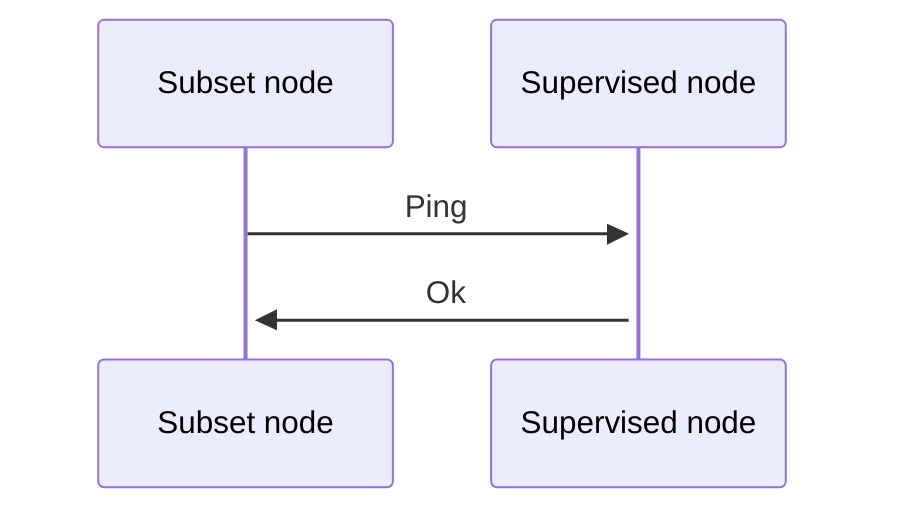

Each beacon chain's subset is responsible to perform verification of the nodes is in charge to monitor.
So periodically (when a transaction is confirmed or before a slot creation), the nodes of a given subset perform P2P availability sampling of the given peers.

A timeout of 1s is given in which a node should respond otherwise it will considered as locally offline by the beacon chain

