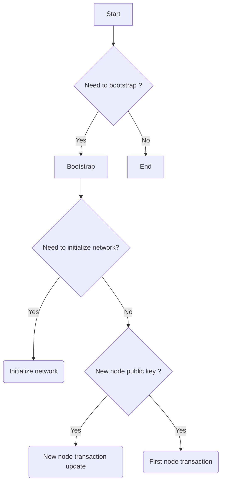

When the Archethic node starts, a task is launched to perform the node bootstrapping to join the network.

To be able to bootstrap a node, we gather connectivity information (IP, Port, Transport, Reward address, Bootstrapping seeds) and also last synchronization date.

The following flow determines actions to perform according to the node state : network initialization, first bootstrap, next bootstrap

## Network initizialiation

The first node joining the network will be in charge to initialize the network by defining few transaction chains:

- Create first node shared secrets transaction chain with initial dailly nonce
- Create genesis wallets according to the allocation from the UCO token distribution 

## First node bootstrapping

During the first initialization, a node will contact P2P bootstrapping seeds (anchor nodes) to be able to fetch existing nodes.

Next a node will create transaction to publish its connectivity and crypto information which will authorize or not new joining node.

Once a node is authorized, after the success of this transaction, it can decrypt/load the storage nonce (will be used for self-repair) and start the self-repair initial cycle to sync transactions.

## Next time bootstraps

For further bootstraps, the bootstrap tasks determine if an update is required based on connectivity/crypto information changes, then a transaction is emitted to the node chain.

Once validated, the self-repair is also triggered to resync missed transactions.
