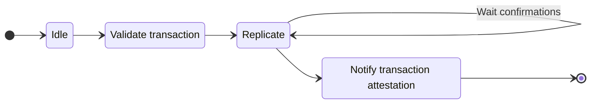
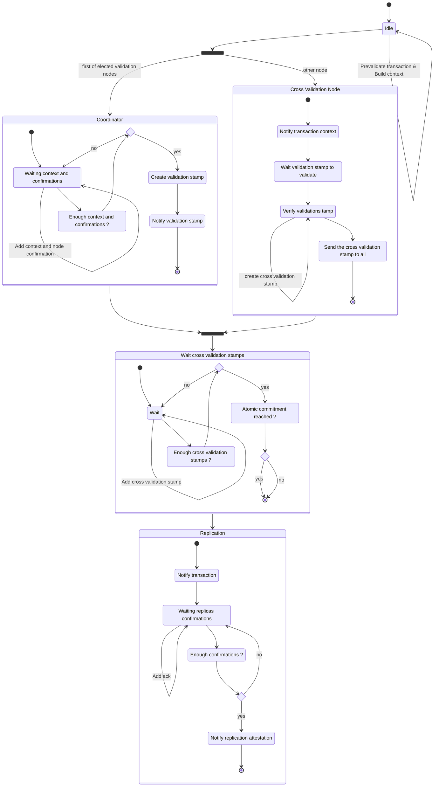

Transaction validation (aka Mining) defines processes and validations algorithms.

Once a transaction is under validation a given process is dedicated to this transaction.
Depending of the number of validation nodes several validation implementation are defined.

Along with validation workflow and processes, this context defines high levels functions to get the validation nodes and to assert their election.

## Standalone validation workflow

When there is not only a single validation nodes (during the network initialization), a process is spawn to manage the transaction validation as a Task to run it (fire-off)

## Distributed validation workflow

When there are multiple validation nodes, a distributed workflow process is spawn as FSM to define the states and evolution of the ARCH consensus algorithm.

This FSM process is ran by all the validation nodes.

Therefore each validation maintains a `Registry` of all the pending transaction validation processes, to be able to redirect P2P messages to the right process.

