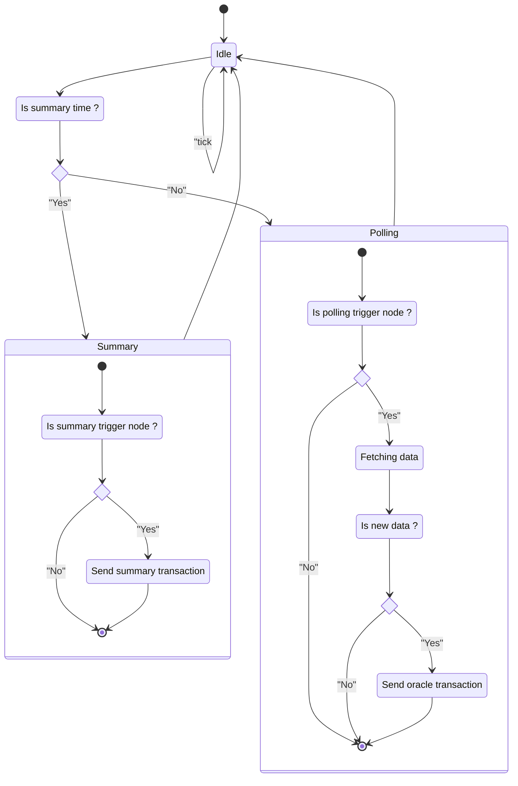

The OracleChain module contains a process in charge of scheduling the data fetching and transaction submitting.

It's modeled as finite state machine.

Three main state are represented:
- `IDLE`: When the process is waiting a new tick to be triggered based on some interval
- `Polling`: When the process must fetch data from external sources
- `Summary`: When the process must aggregate the entire polling transactions for a given interval

:::info
Mainnet and Testnet can have different values based on environment variables.

This is due to simulate quicker events and summary.

For example, 
- on Mainnet: each polling is triggered each minute and the summary each day at 00:00 UTC.
- on Testnet: each polling is triggered each 10s and the summary each minute.
:::

For each actionable state, the process determines if the current running node is in charge to fetch or emit the transaction, based on the election algorithm.

Also to avoid any useless transactions, the process identifies if a new transaction must be emitted regarding the freshness of the information retrieved from the Oracle services.

You can find below a schema representing this finite state machine and its related events.

:::note OracleChain Scheduler FSM

:::note

