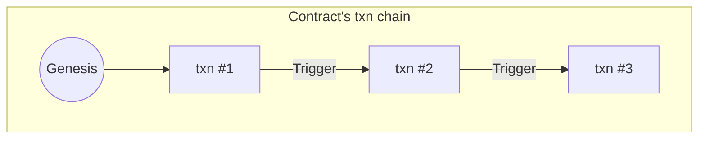

import Tabs from '@theme/Tabs';
import TabItem from '@theme/TabItem';


Let's explore together all the steps to create, deploy and trigger a Smart Contract.

But first, let's just take a quick minute to remind us that a contract is nothing but a transaction with code! When it is triggered, it may or may not create a new transaction in the same transaction chain. That's it! 


<center>



</center>


:::tip
We strongly suggest to create a dedicated chain for each contract, but it is not a requirement.
:::

## I) Creating a dedicated contract's chain

This is helpful for many reasons: 
1. Separate the contract funds from your own.
1. Since there can only be 1 contract per chain, it's mandatory to create more than one.

There are multiple way to do this: 
- Create a new chain
- Derive your own chain

We'll use the **Archethic Address Generator** to create a new chain.

- Open this tool : https://iancoleman.io/bip39/
- Generate 24 words and then copy them
:::danger
[SHOULD WE TELL THEM TO SAVE THEM SOMEWHERE SAFE, OR THE TOTAL OPPOSITE AND HAVE THE PLAYGROUND GENERATE THE SEED WITHOUT GIVING IT TO THE USER?]
:::
- Open this tool : https://testnet.archethic.net/api/web_hosting/0000028cc0478586910bb2f2ab765361254246f430c327c8105dd995addfc15866b9/example/addressGenerator/index.html
- Paste the 24 words in the seed input and click on the `Generate address` button
- This address is the `genesis address` of your contract

## II) Transfer funds to the contract's chain

<Tabs queryString="network">
  <TabItem value="mainnet" label="MainNet" default>
    <ul>
        <li>Open the <a href="https://github.com/archethic-foundation/archethic-wallet#how-to-install-archethic-wallet">Archethic Wallet Application</a> with the device of your choice</li>
        <li>Create a UCO transfer with the <code>genesis address</code> as destination</li>
    </ul>
  </TabItem>
  <TabItem value="testnet" label="TestNet">
  <ul>
    <li>Open the <a href="https://testnet.archethic.net/faucet">Faucet</a></li>
    <li>Fill-in the <code>genesis address</code> of your contract</li>
    <li>Hit the <b>[Transfer 100 UCO]</b> button</li>
  </ul>
  </TabItem>
</Tabs>

To understand how the fees work, check the [Fees' page](/build/smart-contracts/fees)

## III) Code the contract

Open the [Smart Contract Playground](https://scplayground.archethic.net) and paste the following code in the right panel.

```elixir
@version 1

actions triggered_by: interval, at: "0 * * * *" do
    Contract.add_uco_transfer(
        to: "000030831178cd6a49fe446778455a7a980729a293bfa16b0a1d2743935db210da76",
        amount: 1
    )
end

condition inherit: [
    uco_transfers: Map.size() == 1
]
```

The `@version` is an attribute that tells the blockchain miners, which interpreter's version to use. It is important because we want 
to be able to improve the language and still be able to run contracts written with an older version of the language.

Then, in the `actions` block, we define that this contract is triggered once per minute. This contract is doing a transfer of 1 UCO to a specific address.

Finally, in the `condition inherit` block, we just ensure that there is 1 and only 1 UCO transfer resulting of the contract execution.

We will not explain further than this, but if you're feeling curious, check the [Reference](/build/smart-contracts/reference).


## IV) Deploy the contract

- Click on the `[Deploy Contract]` button on the left hand side menu (the gear icon).
- In this form, select the network in which to deploy the contract (MainNet or TestNet).
- Then fill-in the seed of the smart contract chain and click on the `[Deploy]` button.

You should see a success message with a link to see the contract in the explorer.


## V) Trigger the contract

<Tabs queryString="network">
  <TabItem value="mainnet" label="MainNet" default>
    [ HOW DO THEY SEND A TX WITH A RECIPIENT WITHOUT USING THE BUILDER ]
  </TabItem>
  <TabItem value="testnet" label="TestNet">
    [ HOW DO THEY SEND A TX WITH A RECIPIENT WITHOUT USING THE BUILDER ]
  </TabItem>
</Tabs>


