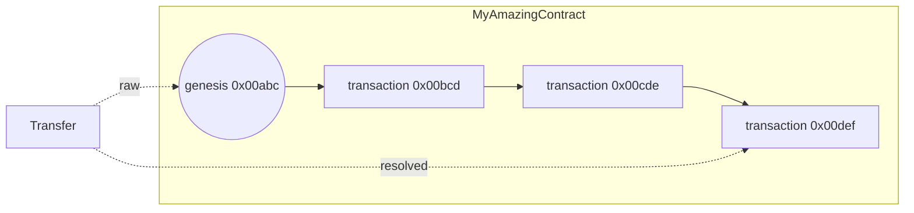

The `actions` block is the code executed when the associated [trigger](/build/smart-contracts/language/triggers) is triggered. 

## Global variables
Depending on the trigger, there are different global variables accessible.

#### contract 

The `contract` variable is a map of the current contract's transaction. See [Appendix 1](#appendix-1-the-transaction-map).

#### transaction 

The `transaction` variable is a map of the transaction that triggered the `actions` block. See [Appendix 1](#appendix-1-the-transaction-map). **It is only available when the trigger is a transaction or an oracle**.

## Generating the next transaction

The main goal of the action block is to generate a new transaction in the smart contract chain.  
To do so, you can use the [Contract](/build/smart-contracts/language/library#contract) module that allows to set the transaction field value.

```elixir
# Set uco ATH in content
actions triggered_by: oracle do
    current_ath = String.to_number(contract.content)
    new_price = Json.path_extract(transaction.content, "$.uco.usd")

    if new_price > current_ath do
        Contract.set_content(new_price)
    end
end
```

:::info
Note that there are 3 fields that are preset before executing the action code.
- type: set to "contract" by default
- code: set with the previous contract code
- ownerships: set with the previous contract ownerships

So you don't need to set the type, the code and the ownerships each time you generate a new transaction.
:::

## Examples

An ICO (Initial Coin Offering) contract:
```elixir 
actions triggered_by: transaction do
    # Get the amount of UCO sent to this contract
    amount_send = Map.get(transaction.uco_movements, contract.address)

    if amount_send > 0 do
        # Convert UCO to the number of tokens to credit. Each UCO worth 10000 token
        token_to_credit = amount_send * 10000

        Contract.set_type("transfer")
        Contract.add_token_transfer(to: transaction.address, token_address: contract.address, amount: token_to_credit)
    end
end
```

A naive voting system
```elixir
 @version 1

 # naive voting system
 # initial content: {"x": 0, "y": 0}

 condition transaction: [
   timestamp: Time.now() < 1700000000,
   content: Regex.match?("^[X|Y]$")
 ]

 actions triggered_by: transaction do
	 vote_for_x = Json.path_extract(contract.content, "$.x")
	 vote_for_y = Json.path_extract(contract.content, "$.y")

	 if transaction.content == "X" do
	   vote_for_x = vote_for_x + 1
	 else
	   vote_for_y = vote_for_y + 1
	 end
	 
	 Contract.set_content Json.to_string([x: vote_for_x, y: vote_for_y])

 end
```

## Appendix 1: The transaction map

- `address`  is the transaction's address.
- `type` is the transaction's type.
- `content` is the transaction's content (it's a string that can contain anything, for example a smart contract state)
- `code` is the transaction's code
- `timestamp` is the transaction's validation timestamp
- `uco_movements` is a map of UCO transfers grouped by _resolved_ address of the transaction.

```
["00001ab...": 1, "00001bc...": 2]
```

- `token_movements` is a map of list of token transfers grouped by _resolved_ address of the transaction 

```
["00001ab...": 
    [
        [amount: 1, token_address: "0000ab12..." , token_id: 1],
        [amount: 1, token_address: "0000ab12..." , token_id: 4],
    ]
]
```

- `uco_transfers` is a map of UCO transfers grouped by address of the transaction.

```
["00001ab...": 1, "00001bc...": 2]
```

- `token_transfers` is a map of list of token transfers grouped by address of the transaction 

```
["00001ab...": 
    [
        [amount: 1, token_address: "0000ab12..." , token_id: 1],
        [amount: 1, token_address: "0000ab12..." , token_id: 4],
    ]
]
```

:::info Difference between transfers and movements
The transfers and movements are almost the same thing. The difference is in the addresses.
The addresses of the transfers are "raw" whereas the addresses of the movements are "resolved". 

- `raw address`: address that was specified on a transfer (usually the genesis but not mandatory)
- `resolved address`: address of the latest transaction of the chain (the chain that contains `raw address`)

Here's an example to understand the difference:

This is a UCO transfer to MyAmazingContract. The transfer is usually done on the genesis address (here: `0x00abc`). But the transfer is actually creating an UTXO on the latest transaction of the chain (here: `0x00def`).



Thus `contract.uco_transfers == [0x00abc: 1]` and `contract.uco_movements == [0x00def: 1]`. 

**In most cases, you'll want to use `movements` instead of `transfers`.**
:::