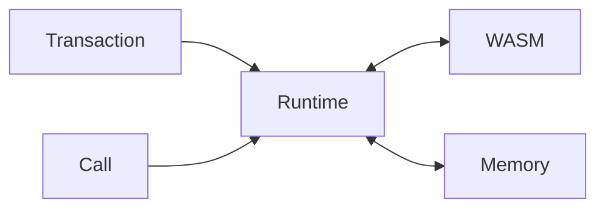
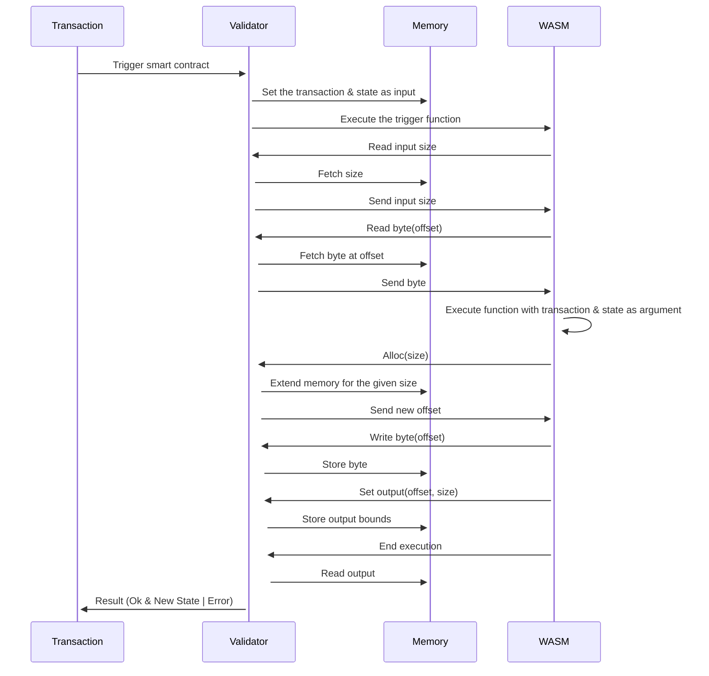
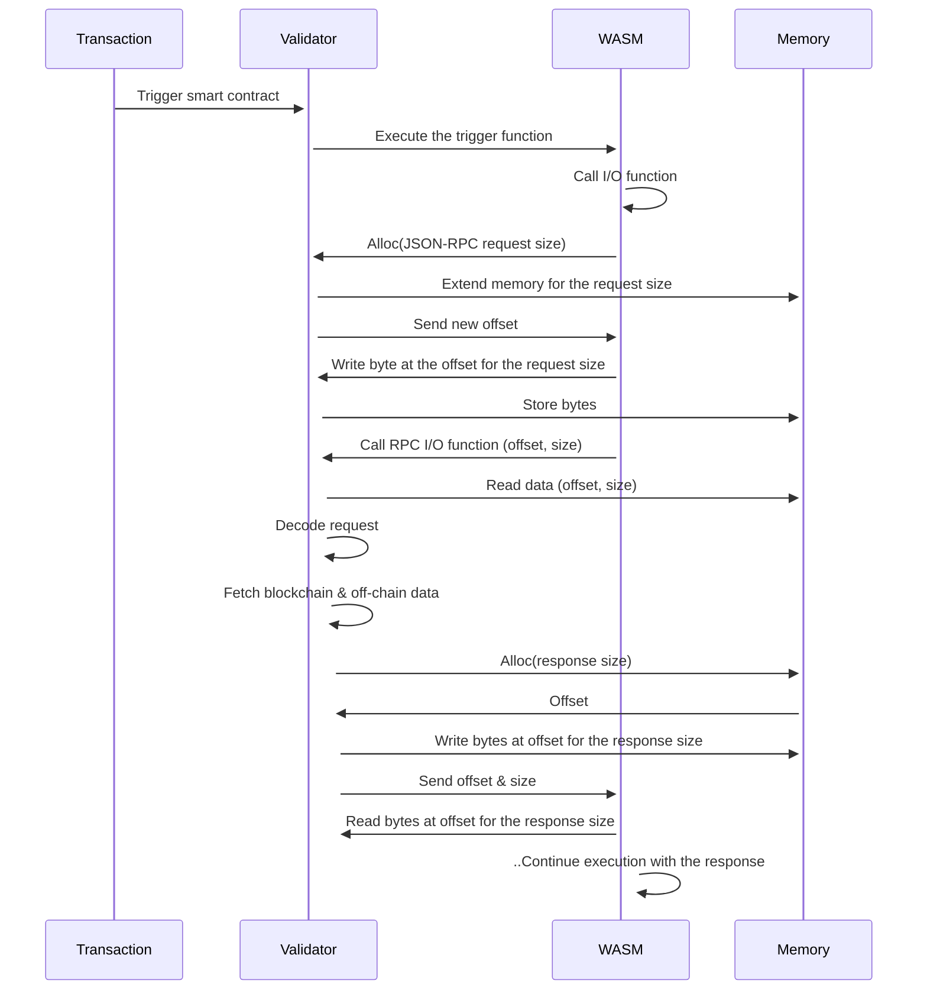

Archethic enables the execution of smart contracts using WebAssembly

Contracts are defined as WASM modules and can be written in multiple languages.

Validators use a WebAssembly (WASM) runtime to execute smart contract code.

The runtime is responsible for the following tasks:
- Instantiation of the WASM modules
- Managing communication between the host blockchain and the WASM module.
- Allocating memory for smart contract input and output.



## Communication

Interaction between the validation process and the WASM module is facilitated through JSON, to simplify implementation of future SDKs.
Hence smart contract input/output need to be standardized as the code is not discoverable due to the compilation phase of languages.

### Manifest

Every smart contract must define a specification or Application Binary Interface (ABI) defined in the manifest of the smart contract.

The manifest is described as a JSON document listing the triggers, the public functions, the input and output types, the type of the state and optional upgrade options.

```jsonc
{
  "abi": {
    "state": {
      "counter": "i32"
    },
    "functions": {
      "increment": {
        "type": "action",
        "triggerType": "transaction",
        "input": {
          "value": "u32"
        }
      },
      "getFactorial": {
        "type": "publicFunction",
        "input": {
          "from": "u64"
        },
        "output": "u64"
      }
    }
  },
  "upgradeOpts": {
     "from": "000………." // Address allowed to upgrade the contract
  } 
}
```

With this manifest and without having to execute code, the validators are able to:
- type check the input
- inform the user and dApps about output and state types
- enable the upgrability of contract

### Reserved types

Some reserved types are defined and supported by the runtime for validation and casting.

#### Scalar

- `u8`, `i8`, `u16`, `i16`, `u32`, `i32`, `u64`, `i64`: Define any integer
- `string`
- `boolean`

#### Complex

Complex types are defined and transmitted as JSON to support multiple encoding 
- Address: `{ hex: "0000..."}`
- PublicKey: `{ hex: "0000..."}`
- Hex: `{ hex: "01234..."}`

### Hooks (Reserved functions)

WebAssembly smart contract can define any kind of custom functions for transaction and public calls. 

However, the runtime can expect some defined reserved functions to leverage hooks to automate some actions in specific period to simplify developer experience.
Some functions are reserved for this purpose: `onInit`, `onUpgrade`, `onInherit`

| Function name | Purpose | Execution context | 
|-|-|-|
| onInit | This behaves as a constructor or initializer of the contract’s state | During the transaction's validation of the first chain's transaction. <br />The resulting state will be injected into the transaction’s validation as unspent output  |
| onUpgrade | As Archethic’s upgrade is native, a specific and magic trigger is supported as `code_upgrade` to correspond to the [AEIP-22 - Smart Contract upgradability spec](https://github.com/archethic-foundation/aeip/blob/main/AEIP-22.md) and will replace the new code of the contract |  During the execution of the `code_upgrade` function to generate the new state to be injected into the transaction’s validation as new unspent output. <br />The previous state is injected into the function but using the new code to act as migration code for the contract’s state. The resulting state will be injected into the transaction’s validation as unspent output | 
| onInherit | This function ensures a way to assert some conditions along the chain’s inheritance (i.e. origin family devices, hard-coded rules, etc.) | During transaction’s validation to ensure inherit conditions. <br />No return is expected, it should assert or throw on user’s defined conditions |

## Memory management

WASM doesn't support the communication of complex data structure and work with a limit set of opcodes, we have to leverage custom memory management to allow communication in and out for complex structure such as string, list, objects.

To facilate it, for each smart contract a dedicated memory process is allocated to ensure communication between the validator (host) and the contract (WASM module).



SDK implementations provides functions for WASM module to be imported in order to to read and write into the shared memory.

## Host functions

Additionally, the runtime supports functions to read external data such as blockchain & off-chain data sources.
This works similarly as the memory management by providing functions to import in SDK to allow communication with the validator.

I/O requests are encoded as JSON-RPC request to simplify serialization of method & params and allow extensibility.



### getBalance (CHAIN)

Fetch the balance of a given address

#### Request:
```json
{"method" => "getBalance", "params": {"hex": "0000..."}}
```

#### Response:
```json
 {"ok": {"value": {
  "uco": 1000000,
  "token": [
    {
      "tokenAddress": { "hex": "0000..." },
      "tokenId": 0,
      "amount": 10000000000
    }
  ]
}}}
```

### getGenesisAddress (CHAIN)

Fetch the genesis address of the transaction chain that contains a transaction at the address. 

If there is no transaction, it returns the given address.

#### Request
```json
{"method": "getGenesisAddress", "params": {"hex": "0000..."}}
```

#### Response:
```json
{"ok":{"value":{ "hex": "0000..."}}}
```

### getFirstTransactionAddress (CHAIN)

Returns the first transaction's address of the transaction chain from the given address.

#### Request
```json
{"method": "getFirstTransactionAddress", "params": {"hex": "0000..."}}
```

#### Response:
```json
{"ok":{ "value":{ "hex": "0000..."}}}
```

If there is no transaction, it raises an error.

```json
{"error": "not found"}
```

### getLastAddress (CHAIN)

Returns the last transaction's address of the transaction chain from the given address.

#### Request
```json
{"method": "getLastAddress", "params": {"hex": "0000..."}}
```

#### Response:
```json
{ "hex": "0000..."}
```

If there is no transaction, it raises an error.

```json
{"error": "not found"}
```

### getPreviousAddress (CHAIN)

Returns the last transaction's address of the transaction chain from the given public key.


#### Request
```json
{"method": "getPreviousAddress", "params": {"hex": "0000..."}}
```

#### Response:
```json
{"ok": {"value": {"hex": "0000..."}}}
```

If the public key in invalid or there is not previous addresse associated, it returns an error: 

```json
{"error": "invalid previous public key"}
```

### getGenesisPublicKey (CHAIN)

Returns the genesis public key of the given public key.

If the public key is invalid, it raises an error.

#### Request
```json
{"method": "getGenesisPublicKey", "params": {"hex": "0000..."}}
```

#### Response:
```json
{ "ok": { "value": { "hex": "0000..."}} }
```


If the public key doesn't exists, it returns an error.

```json
{"error": "not found"}
```

### getTransaction (CHAIN)

Returns the transaction at the given address. 

#### Request
```json
{"method": "getTransaction", "params": {"hex": "0000..."}}
```

#### Response:
```json
{ 
  "ok": { 
    "value": {
      "type": "...",
      "data": {
        "content": "",
        "code": "",
        "contract": {},
        "ledger": {
          "uco": { "transfers": [] },
          "token": { "transfers": [] }
        }
      },
    }
  }
}
```

If there is no transaction at address, it raises an error.

```json
{"error": "not found"}
```

### getLastTransaction (CHAIN)

Returns the latest transaction of the chain that contains the transaction's address

#### Request
```json
{"method": "getLastTransaction", "params": {"hex": "0000..."}}
```

#### Response:
```json
{ 
  "ok": { 
    "value": {
      "type": "...",
      "data": {
        "content": "",
        "code": "",
        "contract": {},
        "ledger": {
          "uco": { "transfers": [] },
          "token": { "transfers": [] }
        }
      },
    }
  }
}
```

If there is no transaction at address, it raises an error.

```json
{"error": "not found"}
```

### callFunction (CONTRACT) 

Calls the exported function of the Smart Contract at the given contract address with given args and return the result value.

It may return an error from the contract function execution.

#### Request

```json
{
  "method": "callFunction", 
  "params": {
    "address": {"hex": "0000..."},
    "functionName": "function_name",
    "args": []
  }
}
```

#### Response

```json
{"ok": {
  "value": ""
}}
```

```json
{"error": ""}
```


### hmacWithStorageNonce (CRYPTO)

Returns the HMAC of the given data using a hash function.

It uses a key created from the contract seed and secret data known by nodes (storage nonce). 
The key created is deterministic and will always be the same for a contract.

#### Request

```jsonc
{
  "method": "hmacWithStorageNonce", 
  "params": {
    "data": {"hex": data},
    "hashFunction": 0 // SHA256
  }
}
```

#### Response

```json
{"ok":{"value": {"hex": "..."}}}
```

If the hash function is invalid, it returns an error:

```json
{"error": "Invalid hash function"}
```

### signWithRecovery (CRYPTO)

Return a signature of the given hash using `Secp256k1` recovery key capability.

It uses a key created from the contract seed and secret data known by nodes (storage nonce). 
The key created is deterministic and will always be the same for a contract.

#### Request

```json
{ "method": "signWithRecovery", "params": { "hex": data }}
```

#### Response

```json
{
  "ok": {
    "value": {
      "r": { "hex": "..."},
      "s": { "hex": "..."},
      "v": 27
    }
  }
}
```

### decryptWithStorageNonce (CRYPTO)

Return decrypted data from the given ciphertext using the storage nonce private key.

#### Request

```json
{"method": "decryptWithStorageNonce", "params": { "hex": "ciphertext"}}
```

#### Response

```json
{ "ok": {"value": "clear data"}}
```

### request (HTTP)

Performs a HTTP request and returns a map with status (integer) and body (string).

This status integer can be any HTTP status code.

#### Requirements

- The URL must use HTTPS protocol.
- The response body's size must be less than 256KB.
- The response must be received in less than 2 seconds.
- The response must be idempotent (= identical every time it is called)
- Only 1 call is allowed per execution. 

:::danger Disclaimer
We discourage to call services that change their internal state directly (such as writing to a database or notifying a user). Because Archethic **relies on atomic commitment of all storage nodes**, it may happen that atomic commitment is not reached and the transaction resulting of a Smart Contract is not validated.

Instead, you should notify the service of the transaction being validated. The service subscribes to that transaction via the GraphQL API, and once it receives a confirmation, it should act accordingly.
:::

#### Request

Parameters:
- `url` the url to fetch
- `method` the HTTP method (`"GET"`, `"POST"`, `"PUT"`, `"DELETE"` or `"PATCH"`)
- `headers` the HTTP headers
- `body` the HTTP body

```json
{
  "method": "request", 
  "params": {
    "body": body,
    "headers": headers,
    "method": method,
    "uri": uri
  }
}
```

#### Response

```json
{
  "ok": {
    "value": {
      "status": 200,
      "body": {}
    }
  }
}
```

The function raises if the requirements are not meet.

```json
{"error": "..."}
```

### requestMany (HTTP)

Performs multiple HTTP requests and returns a list of map with status (integer) and body (string).

See [request](#request-http) for more details

#### Request

```json
{
  "method": "requestMany", 
  "params": [
    {
      "body": body,
      "headers": headers,
      "method": method,
      "uri": uri
    }
  ]
}
```

#### Response

```json
{
  "ok": {
    "value": [{
      "status": 200,
      "body": {}
    }]
  }
}
```

The function raises if the requirements are not meet.

```json
{"error": "..."}
```