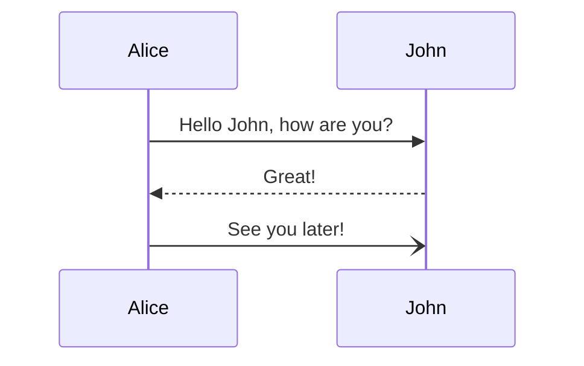

This documentation is maintained by the Archethic Foundation. It's an open source project and aims to be the most extensive
resources of knowledge on Archethic and its ecosystem.

We welcome contributions from anyone and are grateful for even the smallest of improvement from typo issues, to proposals, to enhance explaination or create diagrams, etc.
Therefore, pull requests, discussions, and contributions from the community are encouraged.


## How to contribute

You can contribute on the [archethic-foundation/archethic-docs repository](https://github.com/archethic-foundation/archethic-docs). The documentation is build with [Docusaurus](https://docusaurus.io) and each page is written in Markdown which is an easy to learn syntax extension to plain text that make creating links, rendering images and nice looking formatting example.


### Guidelines

There are few basic ground-rules for contributing:
1. No `--force` pushes or modifying the Git history
2. Pull requests are preferred to issues, especially for small changes such as typos. Issues should be used for generic or broad-based changes or missing content. Suggestions and requests are encouraged.
3. Please `fork` or use `non-main branches`.
4. `Significant modifications`, even by contributors, ought to be subject to a pull request to solicit feedback from other contributors.
5. Pull requests to solicit feedback are encouraged for any other non-trivial contribution but left to the discretion of the contributor.
6. Contributors should attempt to adhere to the prevailing MarkDown style, language, and layout.
7. Correct grammar should be used at all times. Pull requests with typos will not be merged until fixed.
8. Care should be taken to remain as objective and informative as possible. There should be no editorializing, and external bias should not be present.

### Diagrams

The documentation supports also diagram through the use or [Mermaid](https://mermaid-js.github.io) which permits to create diagram with markdown code:

Inserting this code:
<p>```mermaid
<br />
sequenceDiagram<br />
&nbsp;&nbsp;&nbsp;Alice->>John: Hello John, how are you? <br />
&nbsp;&nbsp;&nbsp;John-->>Alice: Great!<br />
&nbsp;&nbsp;&nbsp;Alice-)John: See you later!<br />
```
</p>

will output this diagram



To help you design them you can leverage an [editor](https://mermaid.live/) to visualize the diagrams.
