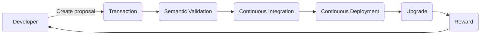

A DAO (Decentralized Autonomous Organization) is a decentralized organization whose governance rules are automated,
immutable, and transparently embedded in a blockchain.

It's one of the biggest challenge in the Blockchain's industry. Often relayed as "code is law", those governance model is 
only applied to a single actor which the miner's owner.

While those model are decentralized, they are ignoring huge part of the ecosystem being the users themselves, the
application providers, the technical contributors, and even the Blockchain itself constrained by the code installed on the
highest computing power.

The governance of the Archethic Blockchain is based on several technical and functional fundamentals:
## Decentralized Identity & Proof of Identity

An essential prerequisite for a human-inclusive governance:
the ability of the ecosystem to uniquely identify a person and
to integrate that person into a relevant group of actors

## Code «On-Chain»

### Introduction

The code used by the nodes is hosted by the Blockchain itself, so the network is certain that all the nodes will
immediately apply the decided updates (via Elixir hot-reload modules and from the information stored in the "transaction content" area). 

The Archethic Blockchain is also equipped with the ability to test the impact of a new feature in real-time.

Each update is stored in the form of a specific transaction chain allowing the network to version (git...) all updates, but also to force each update according to a specific governance (voting quorum, veto right...).

### Details

Archethic Blockchain is using code proposals to have a way to upgrade current blockchain code in a automated and tested way. 

The idea behind the governance on Archethic blockchain is to be able to audit, test and apply code proposals in a automatic, indepedent and secure way across the deployed network.

1. The process begins when a contributor creates a code proposal within a transaction. This code proposal will be checked to ensure that it follows the proper form (contains the correct fields for example).
2. After the code proposal is verified, we start going over the details of the proposal and verifying that it contains correct version, valid upgrade terms and valid changes for example.
3. When the code proposal is considered valid, and after gathering enough approvals from members of the technical council, we start the Continuous Integration phase.
The role of this part is to check that the proposal passes the tests, security checks and code style.
4. If the phase returns a success then we start the Continuous Deployment phase. 
The aim of this part is to test the proposal in a real world settings by deploying it into a testnet with various nodes performing multiple distinct functions.
5. After the last phase succeeded, we launch the next phase which consists of upgrading the actual nodes to the new versions and finally rewarding all the actors that participated in the global process.

## Incentives

Financing of the work associated with updates, new features, and contributions is an essential element. 
The network has a reserve of one-third of the tokens (with progressive distribution constraints) for this purpose.

