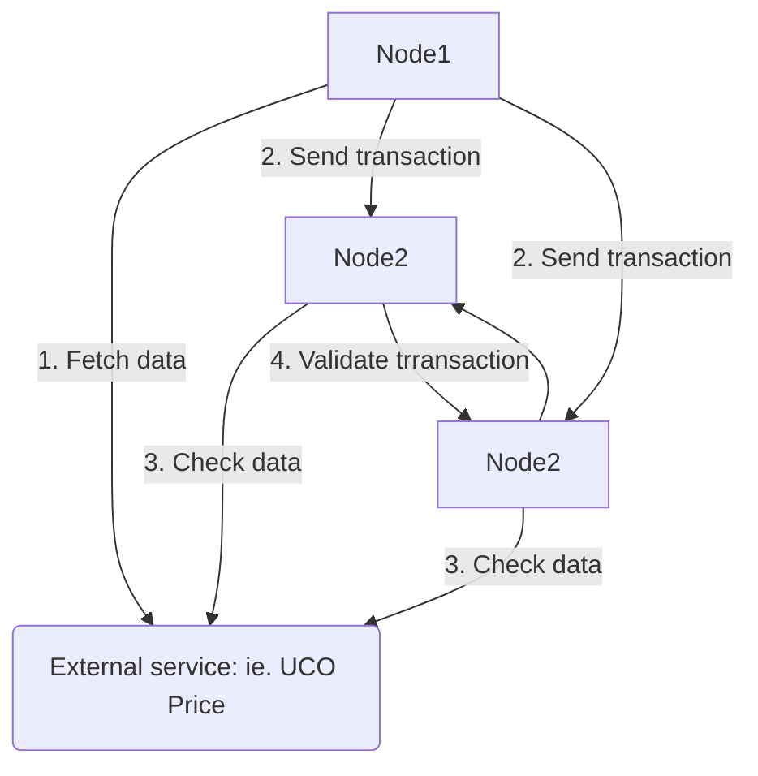

Archethic Blockchain supports Off-Chain communication through a dedicated transaction chain called `OracleChain`.

It aims to gather external data to be used inside the network or the smart contract layer.

## How is it work ?

OracleChain behaves a bit like the [BeaconChain](/learn/sharding/beacon-chain) except the transaction on the chain are generated every 10min but only when there is a new data updated.

It's using a long-polling mechanism to get data from external sources and submit a transaction through ARCH Consensus.

By using ARCH consensus, we ensure the atomic commitment of the data submitted and ensure validity of the information written into the transaction.

Each node received the new transaction from the OracleChain and can apply behaviors from this new data and notify smart contracts which depends on oracle updates.

## Services

The list of services supported by the OracleChain:

- UCO Price Feed: fetching UCO token price from Coingecko in USD/EUR currency and is used for the:
  - Transaction Fee algorithm
  - Auto reward of nodes which didn't receive enough mining rewards

