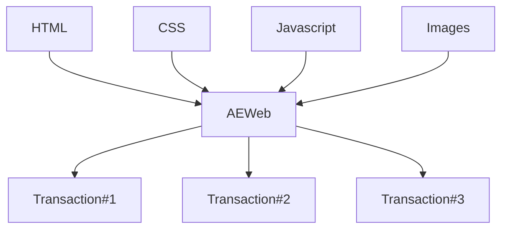

Archethic Web (AEWeb) is using transaction chains to host any website on Archethic Blockchain.

We will describe the following process from the building until the delivery to the browser.

## Transaction building

On the beginning of any hosting, there is a website composed of:

- HTML pages
- CSS files
- Javascript files
- Images
- Videos

When the folder of the website is passed to the AEWeb CLI, the files are analyzed and packaged into blob of 3MB (current limitation of transaction's content).



One of this transaction is called the `reference`. Its goals is to act as a pointer to other transactions. This will help the retrieval of the files and makes upgrades seamless and transparent for end users.

The reference transaction's address will become the address of the website managing its lifecycle.

```json
{
  "aewebVersion": 1,
  "hashFunction": "sha-1",
  "metaData": {
    "index.html": {
      "size": 68420,
      "hash": "ABC123F...",
      "encoding": "gzip",
      "addresses": ["0FB27DAC...."]
    },
    "scripts/main.js": {
      "size": 255121,
      "hash": "01AB2CD...",
      "encoding": "gzip",
      "addresses": ["0AC1BFA9..."]
    } 
  }
}
```

The other transactions (called `data`) will contain the content of the files encoded in base64

```json
{
  "index.html": "b298kJKFS98dj7Xdnsq....", 
  "scripts/main.js": "aGVsbG8gd29ybGQ=" 
}
```

To leverage the maximum of the transaction size, all the content are grouped into the smallest amount of transaction possible.
For example, you could have a website which contains: 5 files:

- HTML page
- Image
- CSS

3 transactions could be generated:

1. Reference:

```jsonc
{
  "aewebVersion": 1,
  "hashFunction": "sha-1",
  "metaData": {
    "index.html": {
      ...
      "addresses": ["0ac7fj..."]
    },
    "assets/app.css": {
      ...
      "addresses": ["0ac7fj..."]
    },
    "assets/image.jpg": {
      ...
      // image.jpg is too big to fit in a single data transaction
      "addresses": ["0ac7fj...", "1fb2ha..."] 
  }
}
```

2. HTML + CSS + Image (chunked by 30%)

```jsonc 
// data transaction: "0ac7fj..."
{
    "index.html": "...",
    "assets/app.css": "..."
    "assets/image.jpg": "..."
}
```

3. Image (remaining chunks)

```jsonc
// data transaction: "1fb2ha..."
{
  "assets/image.jpg": "..."
}
```

## Content delivery
On the other side, the transactions are validated and stored on the Archethic Blockchain.
Any Archethic node expose an API dedicated for the web hosting by AEWeb.

This API takes a reference address as a parameter, and then proceeds to take the path of the file, just like any web server would do.

```sh
https://mainnet.archethic.net/api/web_hosting/0c19fd13......../image.jpg
```


The welcome node will request the reference transaction download to its related shard.
It will parse the reference content and detect the transactions to download for the requested file.

Once the file downloaded, the content will send back to the client and the browser will display the file.

Because websites rendering is composed of multiple HTTP requests for each file, the browser will be able to understand the responses and display the website entirely - while leveraging a single reference on-chain.

:::info Good to know
Once the website retrieved, the data will be cached locally. So, the next time the same person will visit the website, no data will be fetched again.

This will be true until the website and the reference chain evolves.
:::

## Website updates

The first thing a node does when it receives an AEWeb request is to download the latest `reference` transaction from the chain. This behaviour allows a user to update its website and to keep the same URL.

This means that updating a website is as simple as sending a new `reference` transaction!

## Website unpublication

Introduced by [AEIP-13](https://github.com/archethic-foundation/aeip/blob/main/AEIP-13.md), a website can be unpublished by sending the following `reference` transaction:

```json
{
    "aeip": [8, 13],
    "aewebVersion": 1,
    "publicationStatus": "UNPUBLISHED"
}
```

As long as this `reference` transaction is the latest, the nodes will not serve the website. An HTTP status code 410 is sent.

:::caution Data is permanent
The data from an unpublished website (and all previous version as a matter of fact) always remain in the blockchain. Here, we only disable the endpoint to access it.
:::
