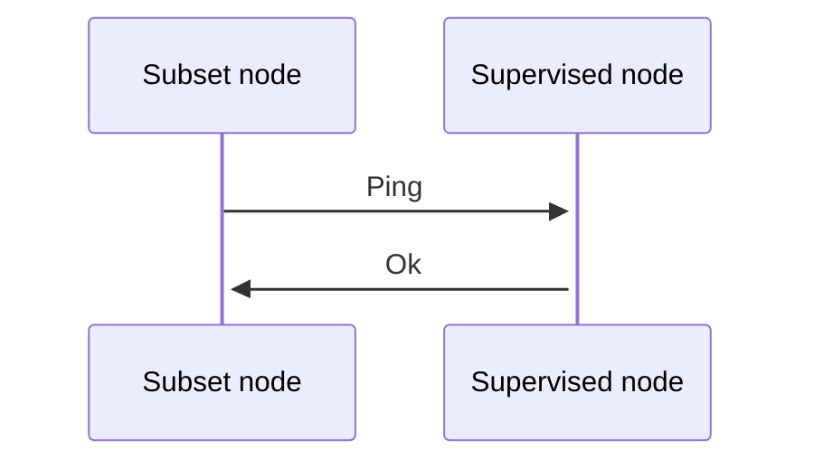

Each beacon chain's subset is responsible to perform verification of the nodes is in charge to monitor.

## Heartbeat

So periodically (when a transaction is confirmed or before a slot creation), the nodes of a given subset perform P2P availability sampling of the given peers. 

:::info
If multiple transactions arrive to a given subset quickly, a timespan of 3s from the previous sampling is used, to determine if we need to sample availability again 
:::

A timeout of 1s is given in which a node should respond otherwise it will considered as locally offline by the beacon chain

## Aggregation

During the transaction generation of the BeaconChain summary, we aggregate multiple slots into a common structure.

All the aggregated P2P samples are accumulated to determine the frequencies of availability and determine the average.

So during the [Self-Repair](/learn/p2p/self-repair), we are using those summary and aggregated data to determine if a node is considered as available for the next epoch/cycle. 

