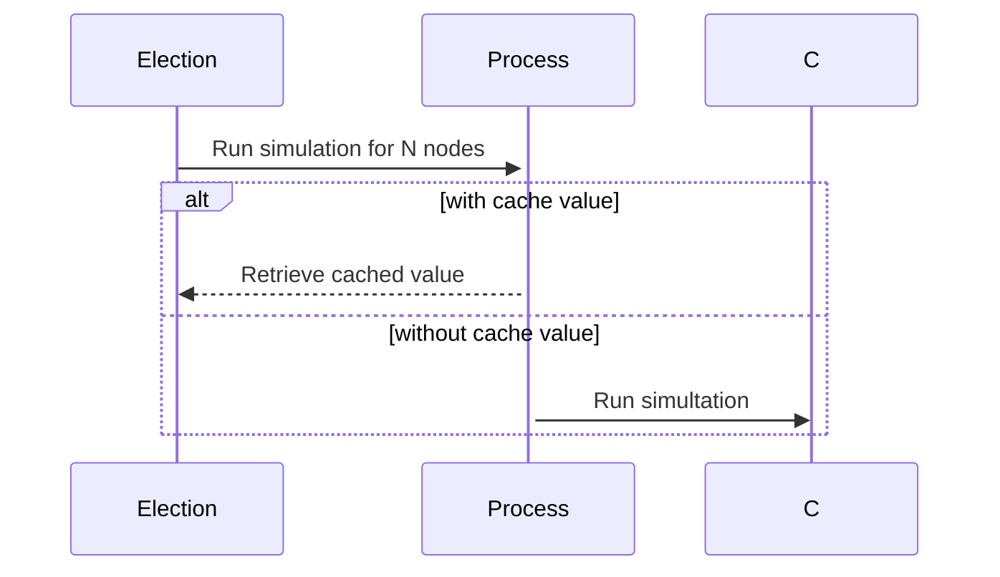

Archethic provides rotating algorithm to elect validation and storage nodes. 

Validation and Storage Election algorithm provides also list of heuristic constraints to fine grained elections. 

## Heuristic constraints

An ETS table is used to store the last constraints values for a faster lookup.

Storage constraints are defined by:
- minimum storage geographical patches
- minimum storage average by geographical patch
- number of replicast

Validation constraints are defined by:
- minimum validation geographical patch distribution
- minimum validation nodes
- validation number based on a given transaction

## Low-Level integrations

Sometimes for performance issue, we are leveraging low-level programming in C, to perform fast computation.

### Hypergeomtric distribution

For example, the Hypergeometric Distribution simulation is computed in C and wrapped in an Erlang port communication.
But for better simulation lookup, a cache is provided as process to hold the last value for a given number of nodes.
If the number of nodes changes, the hypergeometric distribution will be trigger.

The C program is using `GMP` for big float arithemetic operations and `OMP` for parallel computations to make it efficient.

